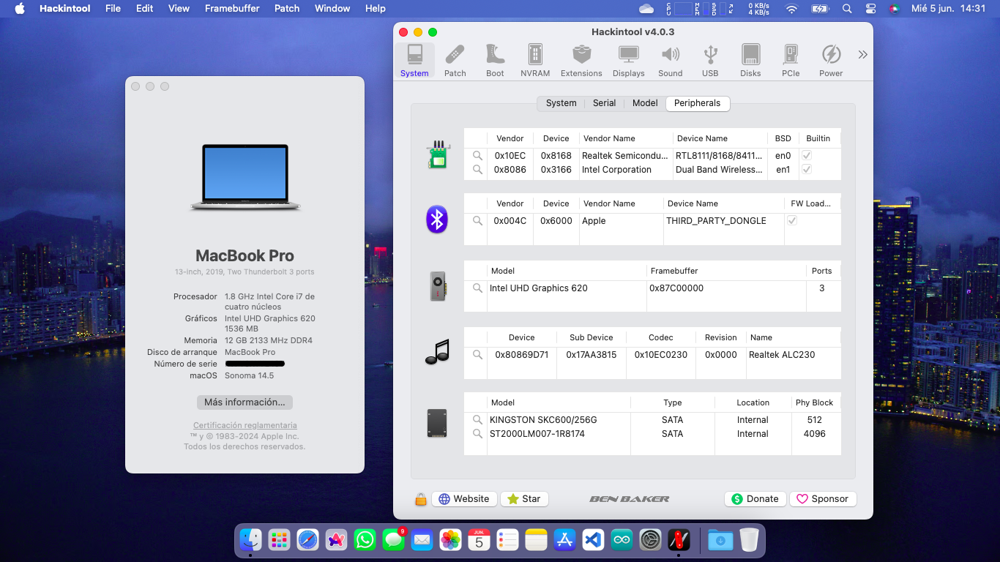

# Lenovo Ideapad 320 15IKB
Lenovo Ideapad 320 15IKB (81BG Type) EFI

:information_source: **La versión actual es totalmente compatible con macOS en función del hardware de mi laptop.**
¡OpenCore, drivers y kexts están actualizados a la versión 1.0.0!

:information_source: La EFI ha sido probada en macOS Sonoma 14.5

 

:warning: **IMPORTANTE** :warning:

Esta no es una guía, por favor consulte [Dortania](https://dortania.github.io/getting-started) antes de hacer nada. No soy responsable de ningún daño. Esta configuración de OpenCore está optimizada para mi hardware específico, así que utilícela solo como referencia o si tiene el mismo hardware o similar.

 

    
## :computer: Hardware:

| **Hardware** | **Especificaciones**                  |
| ------------ | ------------------------------------- |
| **CPU**      | 1.6GHz Intel Core i5-8250U            |
| **GPU**      | Intel UHD 620                         |
| **RAM**      | 12GB (4GB non-removable) 2133MHz DDR4 |
| **SSD**      | 256GB SATA SSD (Kingston SKC600)      |
| **Display**  | 15,6" 1366x768 LCD non-touch display  |
| **Wi-Fi/BT** | Intel Dual Band Wireless-AC 3165 + BT |
| **Ethernet** | Realtek RTL8111                       |
| **Audio**    | Realtek ALC230 (layout-id=20)         |
| **Input**    | PS2 Keyboard & ELAN TrackPad          |

## :white_check_mark: Trabajando:

- [x] Gestión de la energía de la CPU.
- [x] Aceleración de los gráficos.
- [x] Lectura de la batería.
- [x] Teclado y trackpad con todos los gestos de macOS.
- [x] Wi-Fi.
- [x] Bluetooth.
- [x] Puertos USB.
- [x] Salida de vídeo y audio HDMI.
- [x] Ethernet.
- [x] Audio (altavoces internos, conector para auriculares de 3,5 mm).
- [x] Micrófono interno.
- [x] Cámara web VGA.
- [ ] AirDrop
- [x] Handoff.
- [x] iCloud y App Store.
- [x] iMessage y FaceTime.

## :x: No funciona:

Solo AirDrop no funcionan, ya que la tarjeta Intel no es totalmente compatible con macOS. Para que esto funcione, debes reemplazar la tarjeta Wi-Fi por una tarjeta nativa, como la BCM94360NG.

Para la conexión Wi-Fi en Sonoma, puedes instalar Heliport. Debido a su conexión y velocidad más rápidas, lo he reemplazado por Airport.

¡Para Ethernet también puedes usar Ethernet USB!

## Configuración de la BIOS:

- Security / Intel Platform Trust Technology - Disabled
- Security / Intel SGX - Disabled
- Security / Secure Boot - Disabled
- Boot / Boot Mode - UEFI

## Créditos:

[**Apple**](http://apple.com/)

[**Dortania**](https://dortania.github.io/getting-started/)

[**Milad Tahanian**](https://github.com/mtahanian)
